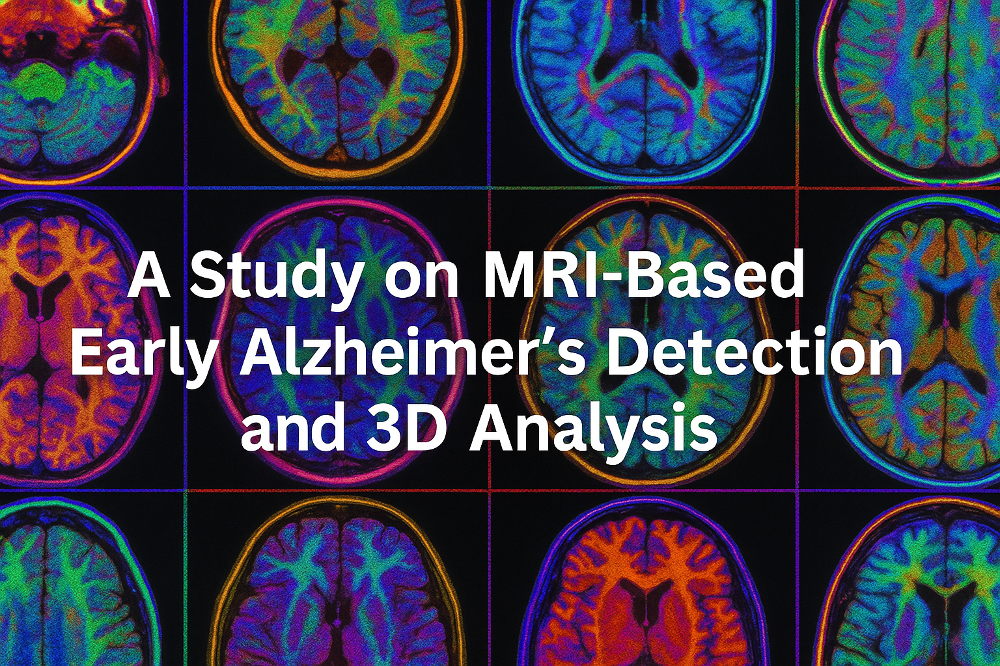

<div align="center">
  
</div>

## Table of Contents

- [Overview](#overview)  
- [Repository Structure](#repository-structure)  
- [Prerequisites](#prerequisites)  
- [Installation](#installation)  
- [Usage](#usage)  
  - [1. 3D Lesion Visualization (`3Dvisualization.py`)](#1-3d-lesion-visualization-3dvisualizationpy)  
  - [2. Brain Volume Analysis (`brain_shrinkage.py`)](#2-longitudinal-volume-analysis-brain_shrinkagepy)  
- [Troubleshooting](#troubleshooting)  
- [Authors and Acknowledgments](#authorsandacknowledgments)


## Overview  
This project implements two complementary pipelines for analyzing MRI scans in the context of early Alzheimer’s detection:

1. **3D White Matter Lesion Scanning**  
   A workflow (`3Dvisulization.py`) that takes FLAIR MRI volumes, strips the skull, extracts selected axial slices, thresholds and clusters high-intensity regions, reconstructs 3D lesion volumes, and provides an interactive VTK viewer.

2. **Longitudinal Brain Volume Analysis**  
   A pipeline (`brain_shrinkage.py`) that groups MPRAGE scans by subject, registers follow-up scans to a baseline, segments brain tissue via K-Means, computes brain volumes over time, and generates publication-quality trend plots.

Together, these tools—one visual, one quantitative—offer both morphological insights and volumetric measurements for early Alzheimer’s research.

---

## Repository Structure 

    ├── firstcode.py # 3D lesion scanning & VTK visualization
    ├── brain_shrinkage.py # Longitudinal brain volume pipeline & plotting
    ├── requirements.txt # Python dependencies for both scripts
    ├── README.md # (this document)
    └── data/ # Place your input data here
    ├── FLAIR/ # FLAIR NIfTI volumes (*_skull_scripted.nii.gz)
    └── MPRAGE/ # MPRAGE NIfTI volumes

---

## Prerequisites  

- **macOS** (tested on Ventura/Sonoma)  
- **Python 3.9+**  
- [Homebrew](https://brew.sh/) (for system libs)

### Install system libraries  
    ```bash
    # for SimpleITK, VTK and OpenBLAS dependencies
    brew install gcc cmake vtk

**Create & activate a Python environment**

    python3 -m venv .venv
    source .venv/bin/activate
    
**Install Python packages**

    pip install -r requirements.txt

## Usage
  ## 1. 3D White Matter Lesion Scanning (3Dvisulization.py)

  **Configure the __main__ block at the bottom of 3Dvisulization.py:**
      
      input_file         = "/path/to/FLAIR_volume_skull_scripted.nii.gz"
      slice_output_dir   = "./data/sliced_images"
      metadata_output    = "./data/cluster_metadata.xlsx"
      cluster_output_dir = "./data/cluster_3d_images"
      selected_slices    = range(16, 25)
      
  **Run**

      python 3Dvisulization.py

  **Results**
      
      TIFF & PNG slices in sliced_images/
      Excel metadata (X, Y, slice, cluster size) in cluster_metadata.xlsx
      Reconstructed 3D lesion NIfTIs in cluster_3d_images/
      Interactive VTK window with orientation labels, intensity slider, and picking info.

  ## 2. Brain Volume Analysis (brain_shrinkage.py)

  **Edit the root_dirs list near top of brain_shrinkage.py:**

    root_dirs = [
    "/Users/…/data/MPRAGE/AD",
    "/Users/…/data/MPRAGE/MCI",
    "/Users/…/data/MPRAGE/LMCI",
    "/Users/…/data/MPRAGE/EMCI"
    ]

  **Run**
  
    python brain_shrinkage.py

  **Results**

    Eight figures (line & scatter plots) showing volume vs. years since baseline, both combined and by category.
    Console summary table of each subject’s scan dates, days since baseline, and computed volumes.

## 3.Methodology
  **3D Lesion Pipeline (3Svisualization.py)**
    
  **1.Skull stripping & normalization →** Convert volume to 16-bit.
  
  **2.Slice extraction →** Save selected axial slices as TIFF/PNG.
    
  **3.Threshold & clustering →** Identify high-intensity lesions, filter by size.
    
  **4.3D ROI reconstruction →** Stack cropped slices, save as NIfTI.
  
  **5.Interactive VTK viewer →** Volume rendering + slider + click info + labels.


  **Brain Volume Pipeline (brain_shrinkage.py)**

  **1.File discovery →** Regex extract date, subject ID, category (AD, MCI, LMCI, EMCI).

  **2.Grouping & baseline selection →** Earliest scan per subject.

  **3.Registration →** Rigid Euler3D alignment of follow-ups to baseline.

  **4.Segmentation →** K-Means (2 clusters) on Gaussian-smoothed [0,1] intensities → largest component mask.

  **5.Volume computation → Count voxels × voxel spacing → mm³**.

  **6.Plotting →** Matplotlib figures: combined & per-category, with/without connecting lines.

  ## Troubleshooting

  **libgfortran.5.dylib not found**

      brew install gcc
      echo 'export DYLD_LIBRARY_PATH=$(brew --prefix)/lib:$DYLD_LIBRARY_PATH' >> ~/.zshrc
      source ~/.zshrc

  
  ## Authors & Acknowledgments
  **Shankar Yellure, Prof. Dr. Chetan Jaiswal and Prof.Kruti Shah.**


  # Thanks to Quinnipiac Univeristy and committee members.

  
